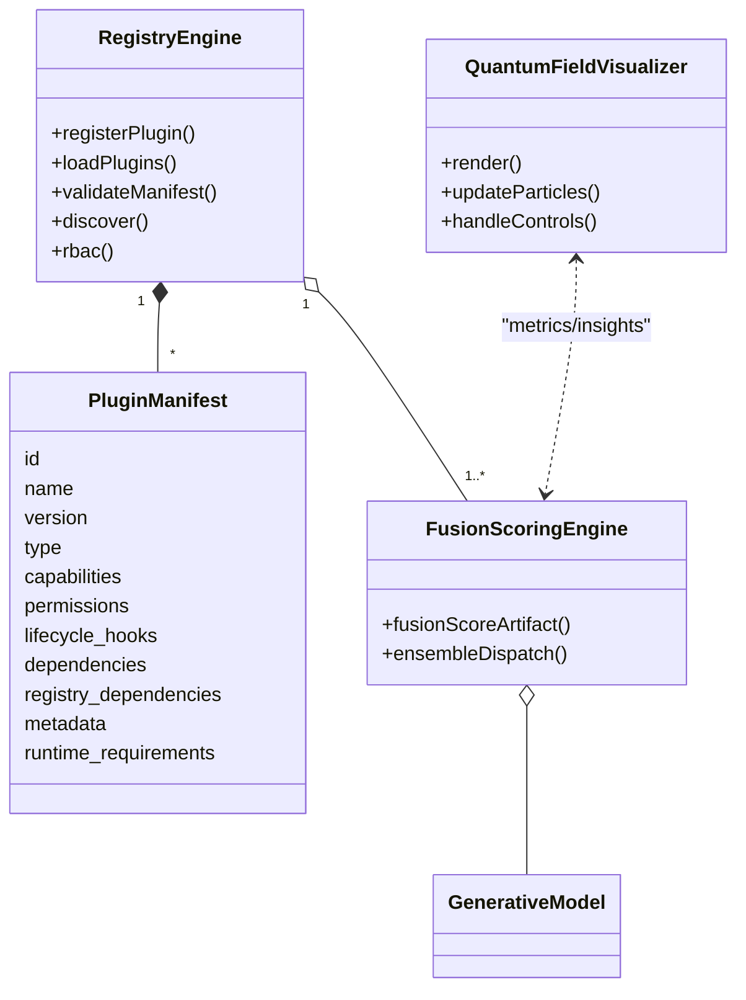

```mermaid
classDiagram
    class RegistryEngine {
      +registerPlugin()
      +loadPlugins()
      +validateManifest()
      +discover()
      +rbac()
    }
    class PluginManifest {
      id
      name
      version
      type
      capabilities
      permissions
      lifecycle_hooks
      dependencies
      registry_dependencies
      metadata
      runtime_requirements
    }
    class QuantumFieldVisualizer {
      +render()
      +updateParticles()
      +handleControls()
    }
    class FusionScoringEngine {
      +fusionScoreArtifact()
      +ensembleDispatch()
    }
    RegistryEngine "1" *-- "*" PluginManifest
    RegistryEngine "1" o-- "1..*" FusionScoringEngine
    QuantumFieldVisualizer <..> FusionScoringEngine : "metrics/insights"
    FusionScoringEngine o-- GenerativeModel
```